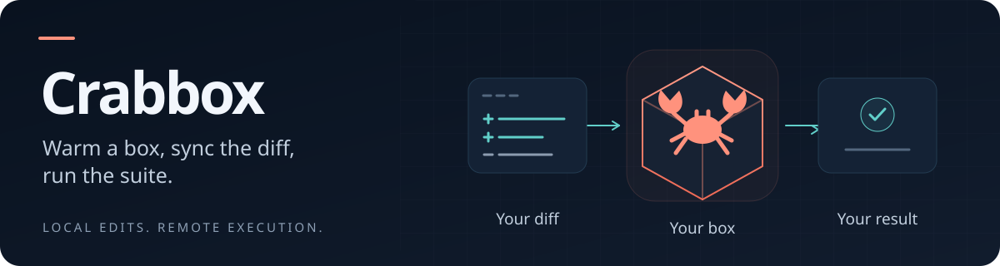

<picture>
  <source media="(max-width: 600px)" srcset="docs/assets/readme-hero-mobile.svg">
  
</picture>

# Run your code on the right machine.

Crabbox runs your repository's commands on remote machines, existing SSH hosts,
and local containers. Keep editing locally; send your working tree to a box,
stream the output, and get the command's exit code back.

[](https://github.com/openclaw/crabbox/actions/workflows/ci.yml)
[](https://github.com/openclaw/crabbox/actions/workflows/release-assets.yml)
[](https://github.com/openclaw/crabbox/releases/latest)
[](LICENSE)

## Changes in this fork

[theblazehen/crabbox](https://github.com/theblazehen/crabbox) is a fork of
[openclaw/crabbox](https://github.com/openclaw/crabbox) with these focused changes:

- **Agent Sandbox over SSH:** the separate
  [`agent-sandbox-ssh` provider](docs/providers/agent-sandbox.md#ssh-variant-agent-sandbox-ssh)
  uploads a static initializer and starts private, key-only Dropbear in the
  existing container, with pinned identity and managed Kubernetes port-forwarding.
  It adds missing tools without installing packages, changing account files, or
  replacing existing tools. The archive-based `agent-sandbox` provider is unchanged.
  Initializer upgrades reuse verified identical image-seeded payloads, preserving
  private helper links and the running daemon instead of rejecting retained workers.
- **Uploaded sync scripts:** generated POSIX sync and workspace-ownership scripts
  travel as private files instead of oversized SSH commands, preserving streamed
  manifests, ownership checks, and cleanup. Failed syncs retain remote diagnostic
  output and the original exit status.
- **Workload stdin:** [POSIX SSH commands and `--script`](docs/commands/run.md#scripts)
  receive piped binary or line input without control commands consuming it or
  replaying it, and live input no longer delays startup until EOF. `--script-stdin`
  remains source-only; Windows/WSL and delegated input paths are unchanged.
- **Safer recovery and capability help:** retry suggestions preserve `--no-sync`
  when requested and never reset the workspace by default. Delegated-provider
  help omits unsupported stdout/stderr capture options.
- **One agent entry point:** the [Crabbox skill](.agents/skills/crabbox/SKILL.md)
  covers execution, sync, input, lifetime and recovery, with specialized material
  loaded only when needed.

The SSH provider requires a compatible **root Linux amd64** container with an
existing executable login shell and writable runtime/workspace paths; see its
[prerequisites](docs/providers/agent-sandbox.md#ssh-variant-agent-sandbox-ssh).
It does not support arbitrary images or ARM. The
[live smoke harness](scripts/test-agent-sandbox-runtime.py) verified existing Git
seed/overlay workflows, sync, scripts, captures/downloads, and local Actions
hydration against the bundled Debian daemon; Git seed/overlay are upstream
features, not new implementations in this fork. Nix-pool lifecycle and SSH
workflows were also tested separately.

**Build this fork from source:** the badges above and release/install references
below describe upstream. Upstream prebuilt releases do **not** contain these
changes; no fork release is published. From this fork's checkout:

```sh
go build -trimpath -o bin/crabbox ./cmd/crabbox
```

**[Quick start](#quick-start)** · [Commands](#everyday-commands) · [Install](#install) ·
[Providers](#providers) · [Documentation](https://crabbox.sh/) · [Security](#trust-model)

Inside a Git repository you trust, with Docker or Podman running:

```sh
crabbox run \
  --provider docker \
  -- uname -a
```

One command creates a Linux container, syncs your checkout, runs `uname -a`,
streams the result, and removes the container. No cloud account or login needed.
For remote compute, choose a [provider](#providers) or your team's coordinator.

## Why Crabbox?

- **Test the code you are editing.** Sync uncommitted changes and nonignored
  files without pushing a commit. Dependency and build directories are excluded;
  install dependencies on the box. [Workspace sync](docs/features/sync.md)
- **Keep a box warm.** Reuse a prepared environment through an edit–run loop,
  or use a one-shot run for work that should clean up afterward.
  [Warm workspaces](docs/commands/warmup.md)
- **Make runs reviewable.** Collect test reports and artifacts; use coordinator
  history, logs, and events to inspect remote work.
  [Evidence](docs/features/hermetic-agent-evidence.md)
- **Choose your infrastructure.** Use local containers, your own SSH machines,
  cloud VMs, or delegated execution providers. Capabilities vary by provider.
  [Provider matrix](docs/providers/README.md)
- **Share capacity with your team.** An optional coordinator owns cloud
  credentials, tracks usage, enforces spend caps, and expires stale leases.
  [Coordinator](docs/features/coordinator.md)

## Install

Homebrew installs the complete release distribution:

```sh
brew install openclaw/tap/crabbox
crabbox --version
```

For **macOS, Linux, and Windows**, you can also download a
[release archive](https://github.com/openclaw/crabbox/releases/latest).
Windows users should follow the [Windows installation guide](docs/windows-install.md).

When a release includes a `crabbox-runtime` directory, keep it beside the real
CLI executable. New filesystem-capable packs contain amd64 and arm64 companions
for Linux, macOS, and Windows. Linux companions additionally provide native
managed execution for Linux and WSL2; copying only the CLI omits those bundled capabilities.
Do not mix a runtime pack with a differently built controller.
An official release with a missing or incomplete pack is a broken installation:
reinstall its matching archive or Homebrew package. It does not silently compile
replacement companions from source. CLI-only source builds retain their existing
shell-backed supervisor route.

Local prerequisites for the SSH workflow: `git`, `ssh`, `ssh-keygen`,
`rsync`, and `curl`. The local quick start also needs a running Docker or
Podman engine.

<details>
<summary>Install with Go (CLI only)</summary>

```sh
go install github.com/openclaw/crabbox/cmd/crabbox@v0.44.0
```

This install channel is supported starting with v0.44.0. Use an explicit release
version; do not use `@latest` while older, incompatible releases remain visible.
The module requires Go 1.26 and prefers go1.26.5; use Go 1.26.5 or newer, or
leave automatic toolchain selection enabled.

`go install` compiles only the CLI. It omits companion executables and assets,
including `crabbox-apple-vm-helper` and the native runtime pack, and is not the
signed/notarized prebuilt distribution. Use Homebrew or a release archive for complete platform capabilities,
especially Apple VM support on Apple Silicon.
Without an installed pack, source-built CLIs can compile the dependency-free
filesystem helper with a local Go 1.26-or-newer compiler. This does not compile
the managed-command supervisor or produce a signed release installation.

</details>

## Quick start

### 1. Try a local box

Inside a **Git repository you trust**, with Docker or Podman running:

```sh
crabbox doctor --provider local-container
crabbox run --provider local-container -- uname -a
```

You should see the container's Linux kernel information. Crabbox returns the
command's exit code and cleans up the one-shot container. First startup includes
an image pull and bootstrap, so allow extra time.

**The default box is bare.** It includes Crabbox's sync/run prerequisites, but
not your project's Node, Go, Python packages, or other build dependencies.
Prepare those before replacing `uname -a` with your test command.

### 2. Run a project's tests

For a Node.js repository with a `package-lock.json` and an `npm test` script,
select an image with Node installed and install the dependencies on the box:

```sh
crabbox run --provider local-container \
  --local-container-image node:22-bookworm \
  --shell 'npm ci && npm test'
```

Choose a Node version compatible with your project. Crabbox does not install
project runtimes for you: supply them with a prepared image, the repository's own
setup scripts, a devcontainer, Nix, or mise/asdf. Crabbox can also reuse
[supported setup steps from GitHub Actions](docs/features/actions-hydration.md);
full Actions semantics require the documented runner path.

### 3. Reuse a box while you iterate

```sh
crabbox warmup --provider local-container --slug dev-box
crabbox run --provider local-container --id dev-box -- uname -a

# Edit locally, then run again on the same box.
crabbox run --provider local-container --id dev-box -- uname -a

# Open a shell, or release the box when finished.
crabbox ssh --provider local-container --id dev-box
crabbox stop --provider local-container dev-box
```

Replace `uname -a` with your test command once the box is prepared. `warmup`
creates a reusable lease; `prewarm` additionally performs Actions hydration.
A lease has both a stable `cbx_...` ID and a friendly slug; either works with
`--id`.

For a complete repository setup, see [Getting started](docs/getting-started.md)
and [Local Container](docs/providers/local-container.md).

### Already have a team coordinator?

Use the URL supplied by your team; the address below is a placeholder:

```sh
crabbox login --url https://broker.example.com
crabbox doctor
crabbox run -- pnpm test
```

This assumes the repository's provider and remote runtime/dependency setup are
configured. For your own cloud account, follow a
[direct-provider setup guide](docs/providers/README.md) and skip login.
Cloud runs use your infrastructure and may incur charges.

## Everyday commands

| Command | What it does |
| --- | --- |
| `crabbox doctor` | Check local prerequisites, configuration, and provider reachability. |
| `crabbox run -- <cmd>` | One-shot: get a box, sync, run, stream output, release. |
| `crabbox run --shell '<script>'` | The same, for a multi-step shell command. |
| `crabbox warmup` / `crabbox prewarm` | Create a reusable box; `prewarm` also runs Actions hydration. |
| `crabbox run --id <box> -- <cmd>` | Reuse a warm box, syncing only what changed. |
| `crabbox ssh --id <box>` | Open an interactive shell on the box. |
| `crabbox job run <name>` | Run a named workflow defined in `.crabbox.yaml`. |
| `crabbox list` / `crabbox stop <box>` | See active boxes, and release one when finished. |

Pass long commands as a file with `--script <file>` instead of a large quoted
string. Every command has a page under [Commands](docs/commands/README.md), and
the [CLI reference](docs/cli.md) lists all flags and environment variables.

## When a run fails

| Situation | Try this |
| --- | --- |
| The run never reaches the box | `crabbox doctor --provider <name>` for prerequisites and reachability. |
| You need to inspect the failure | Add `--keep-on-failure`, then `crabbox ssh --id <box>` into the exact box that failed. |
| A warm box behaves as if stale | Add `--full-resync` to reset the remote workdir before syncing. |
| Output is binary or terminal-hostile | `--capture-stdout <path>`, and `--capture-stderr <path>`. |
| You need a file the run produced | `--download remote=local`, repeatable for several files. |

Failed SSH-backed and Blacksmith delegated runs save local bundles to
`.crabbox/captures/*.tar.gz` by default, falling back to the Crabbox user state
directory when the project destination is unwritable. Follow the reported
`failure-bundle local=…` path; see [local capture storage](docs/observability.md#capturing-run-output-locally).
Crabbox does not scrub bundles, captured output, or artifacts; review them before
sharing.

[Troubleshooting](docs/troubleshooting.md) ·
[History and logs](docs/features/history-logs.md) ·
[Observability](docs/observability.md)

## How it works

```text
Your working tree
       |
       v
Select a box -> Sync changes -> Run command -> Stream output
                    ^                              |
                    |                              v
                    +------ Reuse the box, or release it
```

The **CLI** runs on your machine. For SSH providers, it sends files and runs
commands directly on the **runner** over SSH and rsync. Delegated providers use
their own execution transports.

An optional **coordinator** handles provider credentials, leases, budgets,
history, and cleanup for supported managed providers. It is separate from the
normal CLI-to-runner data path. Local containers and existing hosts work without
a coordinator.

### Coordinator deployment choices

| Path | Use it when |
| --- | --- |
| No coordinator | You want local containers, existing hosts, or direct providers with local credentials and state. |
| Cloudflare Workers + Durable Object | You want the established managed coordinator deployment. |
| Node.js + PostgreSQL | You want to host the coordinator in containers, on a VM, or in Kubernetes. Complete the deployment proof before production cutover. |

State does not automatically migrate between coordinator runtimes. For deployment
requirements and the separate SSM-only private AWS workspace path, see
[Infrastructure](docs/infrastructure.md) and
[Private AWS Workspaces](docs/features/aws-private-workspaces.md).

Read [How Crabbox works](docs/how-it-works.md) for the full lifecycle,
[Architecture](docs/architecture.md) for internals, and [Vision](VISION.md)
for scope and non-goals.

## Providers

Start with the environment you already have:

| Your starting point | Provider guides |
| --- | --- |
| Docker or Podman on your laptop | [Local Container](docs/providers/local-container.md) |
| An existing Linux, macOS, or Windows machine | [Static SSH](docs/providers/ssh.md) |
| A cloud account | [AWS](docs/providers/aws.md), [Azure](docs/providers/azure.md), [Google Cloud](docs/providers/gcp.md), [Hetzner](docs/providers/hetzner.md) |
| Your own virtualization infrastructure | [Proxmox](docs/providers/proxmox.md), [Incus](docs/providers/incus.md), [Firecracker](docs/providers/firecracker.md) |
| Apple Silicon | [Apple VM](docs/providers/apple-vm.md), [Apple Container](docs/providers/apple-container.md) |
| A managed sandbox service | [Daytona](docs/providers/daytona.md), [E2B](docs/providers/e2b.md), [Modal](docs/providers/modal.md) |
| GPU workloads | [RunPod](docs/providers/runpod.md) |

**[Browse the complete provider matrix →](docs/providers/README.md)**

The matrix documents operating systems, sync methods, lifecycle support, and
provider limitations. Support for SSH, snapshots, desktops, and cleanup is not
uniform across providers.

### Machine classes

Managed providers with class-based capacity default to `beast`. Choose a
smaller `--class` deliberately when evaluating cloud capacity. `--class` selects
a capacity tier; `--type` pins a provider-native instance size and disables
class fallback. See [Configuration](docs/features/configuration.md) and your
provider's guide for sizes and pricing considerations.

## Highlights

Once the basic loop works, add the capabilities your workflow needs:

| Capability | What it adds |
| --- | --- |
| [Named jobs](docs/features/jobs.md) | Store setup, test commands, and cleanup policy in the repository. |
| [Actions hydration](docs/features/actions-hydration.md) | Reuse supported runtime and tooling setup from existing workflows. |
| [Failure capsules](docs/features/capsules.md) | Capture a failing CI run as a bundle you can replay. |
| [Checkpoints](docs/features/checkpoints.md) | Save, restore, or fork workspace state, with provider-dependent snapshot support. |
| [Desktop and browser QA](docs/features/interactive-desktop-vnc.md) | Drive a visible UI and collect screenshots or recordings on supported providers. |
| [Portal](docs/features/portal.md) | View authenticated lease/run history, logs, and supported desktop/code bridges. |
| [Artifacts](docs/features/artifacts.md) and [telemetry](docs/features/telemetry.md) | Collect outputs, test summaries, and resource measurements for review. |
| [Pond peer groups](docs/features/pond.md) | Discover and connect related leases for multi-machine workflows. |

## Configuration

Generate a starting configuration from inside your repository:

```sh
crabbox init --detect
crabbox config show
```

Settings resolve in order: flags, environment, repository configuration, user
configuration, then defaults. Run `crabbox config path` to locate your user
configuration; its default location varies by platform. A few lines in
`.crabbox.yaml` are usually enough to drop the flags from your everyday commands:

```yaml
provider: local-container
localContainer:
  image: node:22-bookworm
lease:
  idleTimeout: 30m
```

Review the generated configuration and setup before running it. Put repeatable
validation flows in [named jobs](docs/features/jobs.md), then invoke them with
`crabbox job run <name>`.

Your shell environment is not forwarded. Only `CI` and `NODE_OPTIONS` cross over
by default; add names to `env.allow` in configuration, or pass `--allow-env NAME`
and `--env-from-profile <file>` for a single run. Keep provider credentials in
environment variables or user configuration, outside the repository, and never in
command-line arguments.

See [Configuration](docs/features/configuration.md) for the full schema,
[Environment forwarding](docs/features/env-forwarding.md) for the allowlist,
[Sync](docs/features/sync.md) for file selection, and [CLI reference](docs/cli.md)
for flags and environment variables.

## Integrations

`crabbox init --detect` also generates a repository-local Agent Skill for
compatible coding agents. To install the published skills separately:

```sh
npx skills add openclaw/crabbox --skill crabbox
npx skills add openclaw/crabbox --skill crabbox-quickstart
```

Choose `crabbox-quickstart` for the first local Docker/Podman run, and `crabbox`
for remote execution and repository workflows. **Skills teach the agent;
install the CLI separately.** Other installation and discovery paths are in the
[agent integration guide](docs/integrations/agents.md).

- **[Zed](integrations/zed/README.md):** checked tasks, YAML support, and a
  separate `crabbox open --editor=zed` remote-project handoff.
- **[Herdr](plugins/herdr/README.md):** lease controls and repository workflows
  in the action palette.

See the [integration catalog](docs/integrations/README.md) for installation,
current distribution status, and lifecycle boundaries.

## Who Crabbox is for

Crabbox fits maintainers with expensive test suites, contributors who need a
repeatable environment, automation that needs reviewable execution evidence,
and teams sharing remote capacity. Use it alongside CI for interactive tests,
builds, browser checks, and platform-specific validation.

## Trust model

Crabbox is a developer execution tool, **not a hostile multi-tenant sandbox, a
secrets scrubber, or a replacement for CI**. It trusts the local OS user,
repository configuration, project tooling, and authenticated coordinator
operators. Review unfamiliar repositories before running them: configuration can
execute helpers, mount host resources, and control infrastructure.

Coordinator access controls support cooperative teams; they do not isolate
mutually adversarial tenants. Captured output, artifacts, and failure bundles are
not automatically scrubbed of secrets. Review them before sharing. Local container
socket passthrough grants access to the host engine.

Read the [Security Policy](SECURITY.md),
[Operational security](docs/security.md), and
[Artifacts guide](docs/features/artifacts.md) for the supported boundaries.

## Docs

**[Documentation site](https://crabbox.sh/)** ·
[Documentation index](docs/README.md) · [Changelog](CHANGELOG.md)

| I want to… | Start here |
| --- | --- |
| Set up a repository | [Getting started](docs/getting-started.md) · [Configuration](docs/features/configuration.md) |
| Look up a command or feature | [Commands](docs/commands/README.md) · [Features](docs/features/README.md) · [CLI](docs/cli.md) |
| Understand the design | [Concepts](docs/concepts.md) · [Architecture](docs/architecture.md) · [Source map](docs/source-map.md) |
| Operate shared infrastructure | [Infrastructure](docs/infrastructure.md) · [Operations](docs/operations.md) · [Observability](docs/observability.md) |
| Debug a run | [Troubleshooting](docs/troubleshooting.md) · [History and logs](docs/features/history-logs.md) · [Performance](docs/performance.md) |
| Extend Crabbox | [Provider authoring](docs/features/provider-authoring.md) · [External provider](docs/providers/external.md) · [Repository guidelines](AGENTS.md) |

## Development

Contributions are welcome. Read [Repository guidelines](AGENTS.md) for architecture
boundaries, coding conventions, and review expectations, and
[Documentation authoring](docs/README.md#about-these-docs) for site conventions.

<details>
<summary>Build, test, and release reference for contributors</summary>

```sh
# Go CLI
go build -trimpath -o bin/crabbox ./cmd/crabbox
go vet ./...
go test -race -timeout=20m ./...

# Coordinator runtimes (Node 22+ locally; CI runs Node 24)
npm ci --prefix worker
npm test --prefix worker
npm run build --prefix worker
npm run check:node --prefix worker
npm run build:node --prefix worker

# Repository scripts
node scripts/generate-linux-readiness.mjs --check
node scripts/generate-bootstrap.mjs --check
node --test scripts/*.test.js scripts/*.test.mjs

# Docs
scripts/check-docs.sh

# Optional live smoke, when broker/provider credentials are available
CRABBOX_LIVE=1 CRABBOX_LIVE_REPO=/path/to/my-app scripts/live-smoke.sh

# Firecracker host readiness smoke (read-only; reports environment_blocked when Linux/KVM assets are missing)
CRABBOX_BIN=./bin/crabbox scripts/live-firecracker-smoke.sh
```

CI runs the full gate (gofmt, vet, race tests, all Go modules, coverage
threshold, repository script tests, docs link/build check, GoReleaser snapshot, and Worker
lint/typecheck/tests/build) on every push and PR. The required `Go` check aggregates
`Go test`, `Go modules` (normal tests in every module, including the root), and
`Go coverage` (90% core coverage threshold). `Go test` requires four parallel CLI
race shards and `Go core` (all other race tests, formatting, vet, deadcode,
Linux supervision proof, and build). Shards discover tests from Go's test list,
including examples and fuzz seeds; new tests need no manual assignment.
Each race shard has a 10-minute package timeout. Coverage uses 20 minutes and
all-module normal tests use 15 minutes. The full local race command above keeps
a 20-minute timeout because it runs the CLI package without sharding.
Go build and module caches are keyed by runner OS/architecture, Go version, and
all module dependency checksums. Failed, canceled, or skipped lanes fail their
aggregate check; required check names remain stable.
Production releases use a serialized, draft-first process: preserve and verify
the signed tag, build and
Developer ID sign/notarize the macOS candidates locally, verify the exact draft
on native Apple Silicon and Intel runners from protected-default code, then
publish those exact artifacts, dispatch the ordinary Homebrew tap update, and
run independent public-download, public Go installation, and native Homebrew
smokes. Publication establishes eligibility; retry a failed Homebrew update
without rebuilding or republishing. The tap handoff is an explicit operator
step, with generic tap reconciliation as an independent fallback. One explicit full release/publish request authorizes
this complete normal sequence without renewed chat approval at each stage.
Narrow requests stay narrow. The original request supplies authorization;
GitHub events alone do not. Sequential technical gates, separate trust domains,
and cancellation boundaries remain mandatory. See
[Release engineering](docs/RELEASING.md).

Git-overlay integration tests use real Git with task-owned local and loopback
origins. Their local SSH stand-ins isolate Git authentication settings and
disable interactive credential requests, including during ordinary seed
fallback. A credential-helper/askpass canary guards this test-only boundary;
the separate production overlay security tests still inject hostile Git config.

CLI runtime optimizations retain the full normal, race, and coverage modes and
their existing deadlines and observation windows. Synchronous POSIX test-executable
helpers suppress only the race runtime's exit delay in their child environment,
preserving inherited detection and reporting options; Windows keeps its existing
execution path. HTTP deadline cases with
explicit configuration and private servers overlap their real waits without
changing timeout contracts. The shared immutable CLI and provider builds stay
inside `M.Run`, with their existing fixture cleanup and rebuild ownership.

Cloudflare, Node/PostgreSQL, container, ingress, secrets, and DNS deployment live
in [docs/infrastructure.md](docs/infrastructure.md). The dedicated ECS Fargate
path is documented in
[Private AWS Workspaces](docs/features/aws-private-workspaces.md).

</details>

## License

[MIT](LICENSE).
